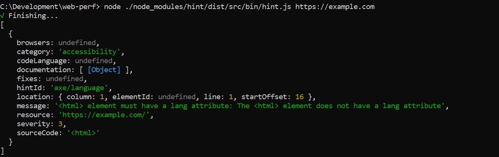

# webhint-formatter-json-object

The `json-object` formatter returns a JSON array of the results. Output is not
very user friendly, but it can be useful when using it as input for
other tools:



To use it you will have to install it via `npm`:

```bash
npm install webhint-formatter-json-object --save-dev
```

**Note:** The recommended way of running webhint is as a `devDependency` of
your project.

And then activate it via the [`.hintrc`][hintrc] configuration file:

```json
{
    "connector": {...},
    "formatters": ["webhint-formatter-json-object"],
    "hints": {
        ...
    },
    ...
}
```

<!-- Link labels: -->

[hintrc]: https://webhint.io/docs/user-guide/configuring-webhint/summary/
